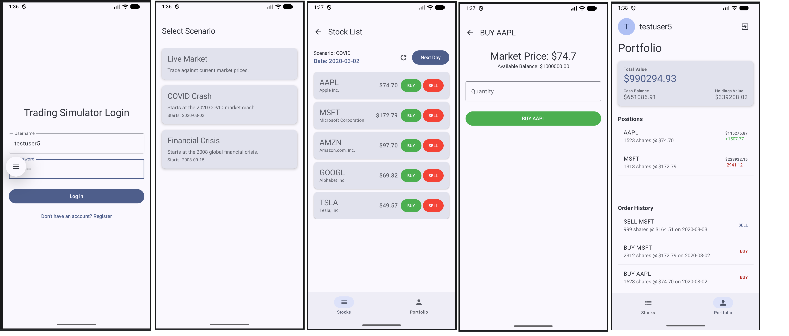

# MyTradingSimulatorLite

A modern, lightweight Android stock trading simulator built with Jetpack Compose. This app allows users to practice trading in both real-time markets and historical scenarios using a virtual portfolio.

## 🛠 Tech Stack

- **Language**: [Kotlin](https://kotlinlang.org/)
- **UI Framework**: [Jetpack Compose](https://developer.android.com/jetpack/compose) (Material 3)
- **Navigation**: [Navigation Compose](https://developer.android.com/jetpack/compose/navigation)
- **Networking**: [Retrofit](https://square.github.io/retrofit/) & [OkHttp](https://square.github.io/okhttp/)
- **Architecture**: MVVM (Model-View-ViewModel) with Repository pattern.
- **Backend**: Custom Trading API (communicating via `10.0.2.2:8080` for emulator access).

